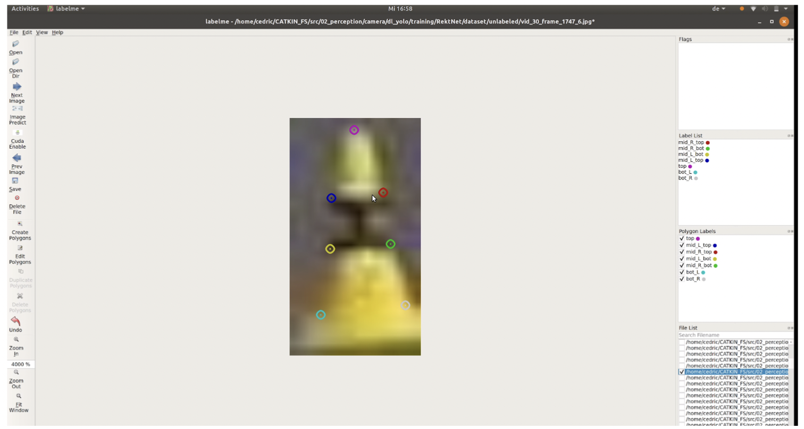

## Description

Labelme is a popular open source labling tool, in our case we added some funtionalities in order to allow auto labeling for Keypoint Detection. 

## Installation 

Make sure you have anaconda installed, then create a new environment with the following commands, activate it and install labelme : 
```bash
conda env create --file req.yaml 
conda activate labelme
pip install labelme 
```

Then make sure to be in the base labelme/director and execute : 
```bash
pip install -e . 
```


You can then open the tool, with the following : (make sure you are in the labelme/labelme folder where all the .py files are)

```bash 
conda activate labelme
python __main__.py
```

In order to use auto labeling :   
download the .pt weights of the neural net by running the .sh file in the RektNet/ folder. 

We use the [MIT](https://github.com/cv-core/MIT-Driverless-CV-TrainingInfra/tree/master/RektNet) dataset as provided in this repo. 

You might need to rename the folder to unlabeled dependig on the download. 


Then you should be good to go ! 

## Usage
The usage is relatively straightforward, make sure the point pattern matches the one below if you need to correct something :


<p align="center">
  
</p>

The label names can also be seen on the right side, so you should easily be able to see where each point belongs. In the middle section, 
of the cone bot always stands for the lower point and top for the higher one. 

Prediction : 

to automatically predict an image, just click the "predict image" button, the labels will be stored automatically and can be corrected. 
A prediction only happens if a .json label file does not exist yet for this file. 

Cuda Enable : 

if you have a cuda capable GPU (Nivida), you can speed up the prediction a little bit by clicking this button. Once you click it again it will switch back to GPU mode. 
Take a look at the terminal for information on which mode it switches to. 

## Update Label Database
Make sure to git branch when you label : 
```bash 
git branch <your_name>labeling
git checkout  <your_name>labeling
```

you can then label and just push it to your branch when you have made progress. 
Thank you for your support !


## Requirements

- Ubuntu / macOS / Windows
- Python2 / Python3
- [PyQt4 / PyQt5](http://www.riverbankcomputing.co.uk/software/pyqt/intro) / [PySide2](https://wiki.qt.io/PySide2_GettingStarted)
- Conda
